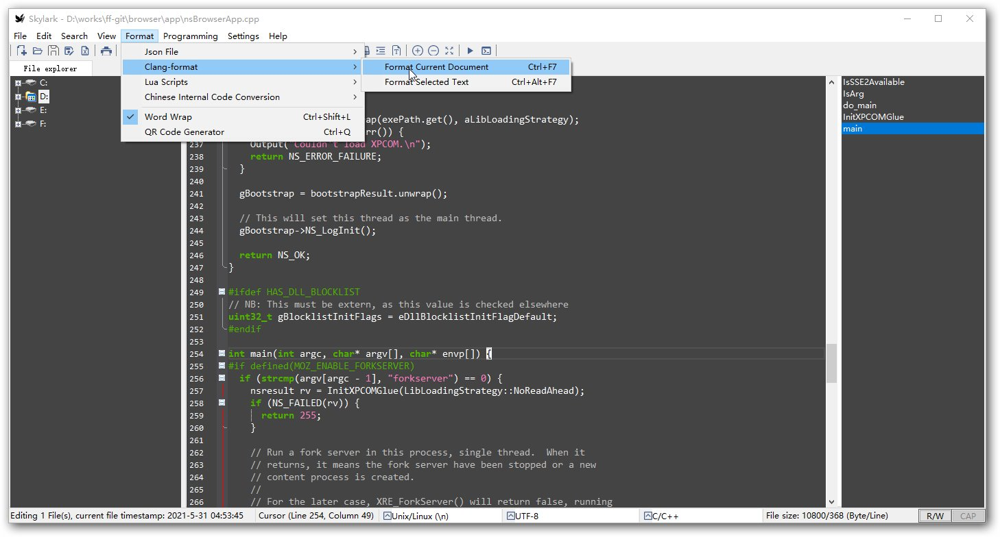
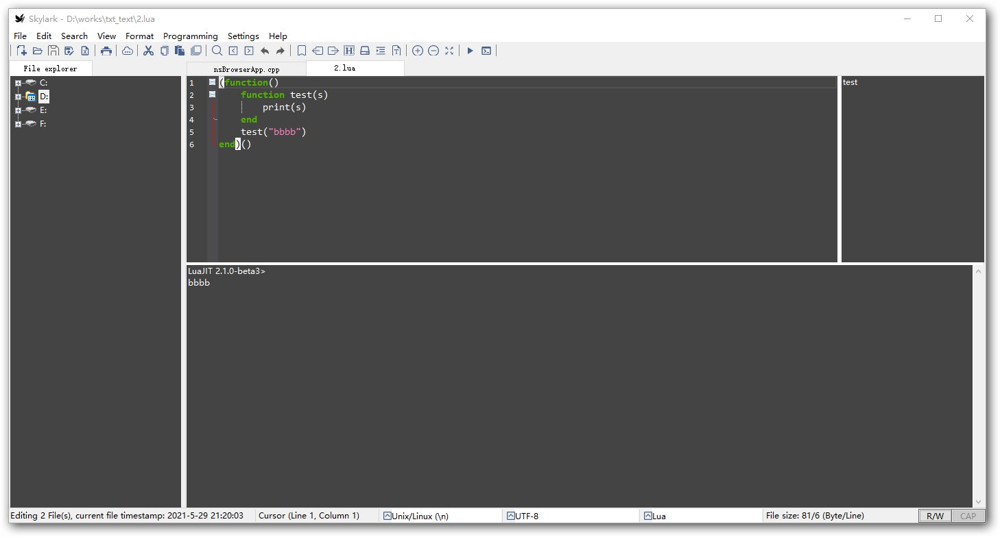
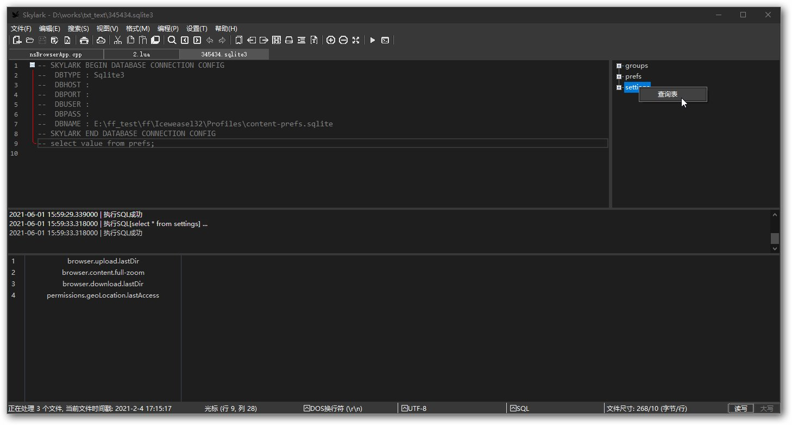
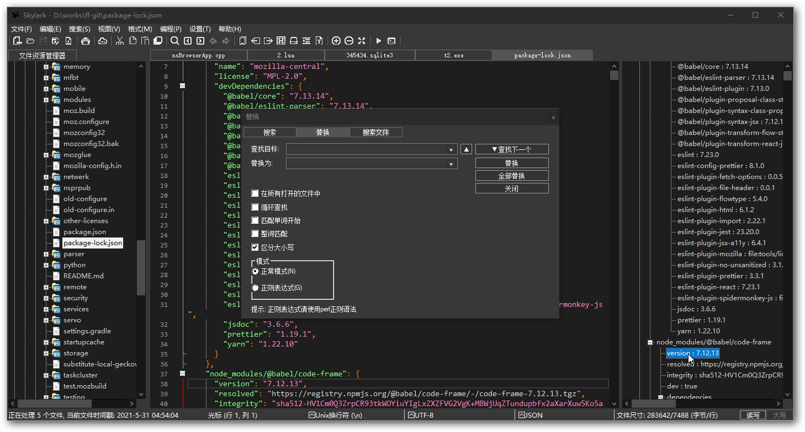
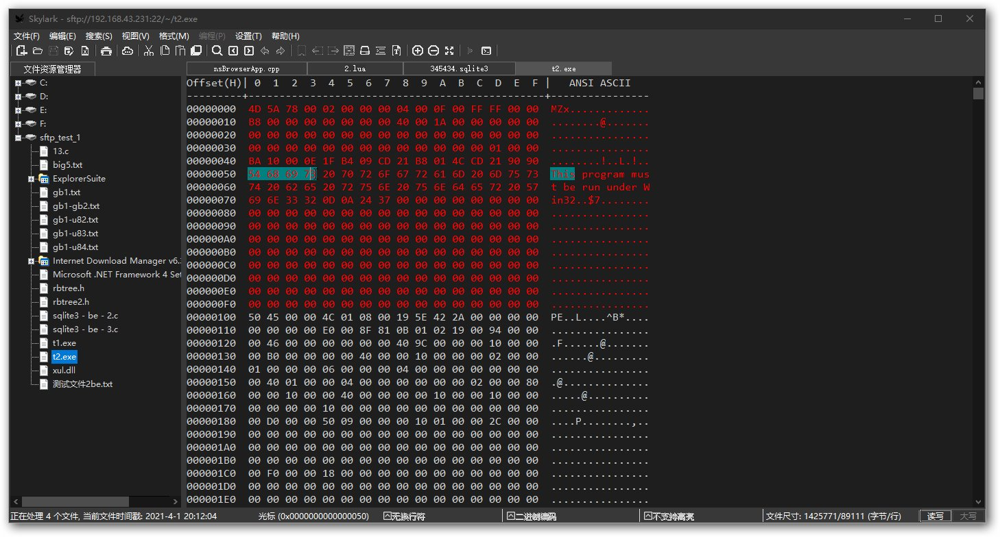

# skylark:
Skylark Edit is a customizable text/hex editor. Small, Portable, Fast.  
Compared with vs code, atom, and more editors, it can start up in less than a second~~  
  
# features:
* Built in file manager and SFTP remote manager.  
* Binary/Hex viewer for files of unlimited size.  
* Encryption and decryption of common key algorithms.  
* Perl Compatible Regular Expression.  
* Support for many encodings, Syntax highlight for a lot of languages.  
* Supports clang-format.  
* Supports dark mode. 

# Build:
* vc14 or above:
  ```
      nmake clean
      nmake
  ```
* clang:
  ```
      nmake CC=clang-cl clean
      nmake CC=clang-cl
  ```
# Screenshots:
* clang-format

* execute lua script

* execute sql

* json parsing

* hex view

